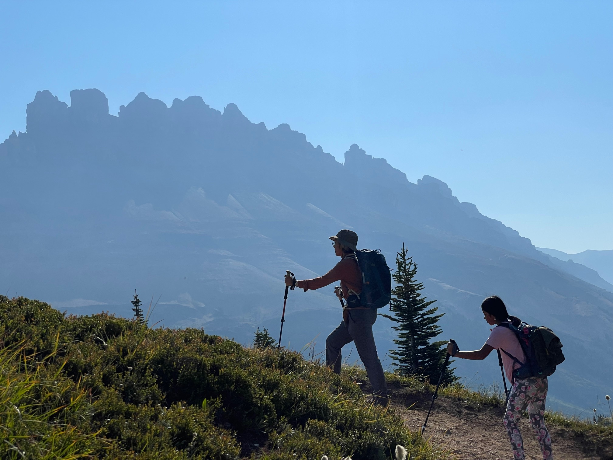

# Track, Map, Share

<b>Adventures In the Canadian Rockies.</b>

In August 2023, I spent 5 adventure-filled weeks in the Canadian Rockies. I worked (remotely) during the day and spent evenings and weekends going on hikes and bike rides. I recorded each of these activities on Strava and have compiled them all into an interactive map. The map is hosted on [Streamlit](https://canadian-rockies-adventures.streamlit.app/). I also built out an accompanying [slide deck](https://github.com/aidarahim/strava_rockies/blob/main/Track%2C%20Map%2C%20Share%20Strava.pdf) to describe the process of building out the App.

<em>Map of the Rockies with activity markers, image, and description.</em>

It was an amazing opportunity to explore the majestic rock-faces and turquoise lakes of Alberta. I would highly recommend anyone who has an anywhere-remote-job to take advantage of the flexibility and travel to and experience other locales.
